# vaBench v4 Tri-Form Benchmark Requirements

Status: normative design draft<br>
Audience: task authors, derivative generators, evaluator authors, and experiment-runner authors

## 1. Purpose

vaBench v4 is organized around circuit-function families. Each accepted scored
family is authored first as a complete DUT task and MUST then produce two
derived task forms:

1. a DUT-writing task;
2. a testbench-writing task;
3. a bug-fixing task.

The DUT family is the single source of truth. Testbench and bugfix tasks are
generated views of that family, not separately authored copies. This document
defines the reusable content, form-specific content, file layout, evaluation
flow, ablation modes, and acceptance gates.

This document is intended to let a separate task-construction process take an
already selected circuit candidate and turn it into a DUT family that can later
be derived safely and mechanically into all three task forms.

Normative terms `MUST`, `MUST NOT`, `SHOULD`, and `MAY` are used in their usual
requirements sense.

## 2. Benchmark Unit and Numbering

The independent content unit is a circuit-function family, not an individual
prompt view.

| Form | Scored IDs | Derivation rule | Candidate output |
|---|---:|---|---|
| DUT | `001-400` | canonical family task | one DUT bundle: one `.va` file or a multi-file Verilog-A system |
| Testbench | `501-900` | DUT ID + 500 | exactly one top-level Spectre `.scs` file |
| Bugfix | `1001-1400` | DUT ID + 1000 | repaired Verilog-A DUT bundle |

IDs `401-500`, `901-1000`, and `1401-1500` are reserved. A family such as
`001` therefore maps to DUT `001`, testbench `501`, and bugfix `1001`.

The target release contains 400 circuit families and 1,200 scored task
instances. DUT, Testbench, and Bugfix are distinct scored tasks and retain
separate results. They MUST NOT be described as 1,200 independent circuit
families, however, because the three task forms derived from one family are
statistically correlated.

## 3. Core Design Decisions

1. **DUT first.** A family MUST be fully specified and validated as a DUT task
   before either derivative is created.
2. **One structured contract.** Public interface, parameters, observable
   behavior, artifact boundaries, and trace requirements MUST originate in one
   structured `family_spec.json` record.
3. **Generated views.** Form instructions and public contracts MUST be rendered
   from structured records. Generators MUST NOT infer contracts by parsing
   Markdown headings or reverse-engineering gold Verilog-A source.
4. **Shared evaluator semantics.** The three forms reuse one behavior-property
   set, one task-specific checker family, one trace contract, and one harness
   specification.
5. **Separate form objectives.** DUT scoring evaluates an implementation,
   testbench scoring evaluates fault-detection strength, and bugfix scoring
   evaluates a repaired implementation.
6. **Inspectable feedback, private scoring.** G2-G5 query one shared feedback
   CLI and may inspect the declared logs, AHDL-like diagnostics, traces,
   metrics, and property results. G0/G1 receive no tool access. Testbench tasks
   receive the supplied correct DUT bundle as read-only public input but no
   starter or reference testbench. Gold answers for DUT/Bugfix, negative-DUT
   sources, checker source, final Spectre results, and evaluator paths are never
   model-visible.
7. **Spectre is the final judge.** AHDL-like checks and EVAS provide fast public
   feedback and preflight evidence. Final accepted scores use the private
   Spectre evaluation path.
8. **Physical isolation.** Repository authoring paths are not runtime access
   policy. Every experiment MUST materialize separate public and evaluator
   bundles and MUST NOT mount the full authoring repository into the model
   sandbox.
9. **Pinned evaluator identity.** An "EVAS version" is the source revision,
   runtime package identity, selected engine/profile, core ABI, and executable
   build hash together. Formal runs MUST validate this identity against a
   release toolchain lock and MUST NOT silently mix EVAS engines.
10. **Atomic DUT bundle.** A DUT candidate is exactly one implementation bundle.
    It MAY be a single `.va` file or a system composed of multiple `.va` files,
    but it remains one DUT answer with one artifact gate and one score. A
    multi-file bundle is not a set of alternative answers or independent DUTs.
11. **One artifact fact source.** Required DUT paths, their module contents,
    module interfaces, and dependency edges MUST be declared once under
    `artifact_contract.files`. Rendered prompts, artifact gates, bugfix bundles,
    and testbench bindings derive from that record; they MUST NOT maintain an
    independent `targets` or `exact_files` list.
12. **Attempt-level evidence.** Every dispatched experiment cell has a bounded
    attempt lifecycle, a frozen candidate hash, exactly one private-score
    decision, and structured token/time/tool evidence. Invalid model output
    remains in the score denominator; infrastructure failures are retained and
    retried under an explicit policy rather than silently dropped.
13. **Dependency-scoped evidence validity.** `TOOLCHAIN_LOCK.json` records a
    complete release snapshot and supports fail-closed preflight, but its whole
    file hash is not a universal evidence cache key. Evidence validity and
    rerun scope MUST be decided from the exact task, oracle, harness, backend,
    and policy components consumed by that evidence.
14. **One semantic evaluation suite.** EVAS feedback and final Spectre scoring
    consume the same public property definitions, case IDs, stimulus semantics,
    trace contract, and checker logic. Backend-specific deck and trace adapters
    MAY differ, but v4 does not maintain separate visible and hidden behavior
    datasets.
15. **Token-bounded execution.** Working token is the only experimental
    resource budget for G0-G5. Model turns, feedback calls, candidate versions,
    cache hits, simulator calls, cost, and wall time are measured but are not
    separate ability budgets. Wall-time and per-call limits remain safety and
    infrastructure controls.
16. **Cross-form isolation.** A formal episode receives exactly one task view,
    runs in a fresh session and workspace, has no network or benchmark-root
    access, and cannot recover paired-form assets. Formal paper experiments MUST
    finish before the complete paired release is made public. A post-release
    continuing leaderboard requires independently held-out families.

## 4. End-to-End Run Model

```mermaid
flowchart LR
    A["Circuit candidates"] --> B["Gate 1: family admission"]
    B --> C["Canonical family_spec.json"]
    C --> D["DUT gold, checker, trace contract, and profiles"]
    D --> E["Gate 2: DUT modeling certification"]
    E --> F["Certified negative catalog and B/T assignment"]
    F --> G["Gate 3: tri-form derivation readiness"]
    G --> H["DUT / Testbench / Bugfix task views"]
    H --> I["G0-G5 prompt records"]
    I --> J["Public bundle + evaluator bundle"]
    J --> K["Model or agent run"]
    K --> L["Private Spectre score"]
```



The normal construction order is:

1. admit an independent circuit function;
2. write the canonical family contract;
3. implement and certify the DUT task;
4. create and certify the five semantic negative DUTs;
5. select one representative Bugfix seed and assign all five negatives to the
   Testbench suite;
6. prove a reference testbench and bugfix seed;
7. generate the two derivative task views;
8. render G0-G5 experiment records;
9. export isolated runtime bundles;
10. run public feedback where allowed, freeze one final candidate per attempt,
    and issue exactly one private-score decision for that frozen hash.

## 5. Reuse Contract

The following ownership table is normative.

| Content | Canonical owner | DUT view | Testbench view | Bugfix view |
|---|---|---|---|---|
| family identity, category, level, provenance | DUT family | reference | reference | reference |
| target files, modules, ports, parameters | `family_spec.json` | implement | instantiate and observe | preserve and repair |
| observable behavior properties | `family_spec.json` | satisfy | exercise and distinguish | restore |
| trace contract | `family_spec.json` | expose declared signals | save declared signals | preserve observability |
| gold DUT bundle | canonical family asset | private score reference | read-only public input and trusted evaluator copy | private repair reference |
| task-specific checker | evaluator-only checker registry | reused | reused | reused |
| canonical cases, harness generator, and backend profiles | evaluator-only family asset | EVAS feedback and Spectre score renderings | candidate-deck execution support | EVAS feedback and Spectre score renderings |
| negative-DUT catalog and assignment | evaluator-only family asset | checker certification | all five certified negatives | one representative buggy seed |
| canonical form instruction | generated from structured records | DUT wording | testbench wording | repair wording |
| G0-G5 wrappers | global mode registry | rendered | rendered | rendered |
| feedback implementation | shared CLI | DUT adapter | testbench adapter | DUT-repair adapter |

Shared content MUST be referenced by stable IDs and hashes. It MUST NOT be
copied into each derivative and edited independently. Form-specific content is
limited to the candidate artifact contract, instruction wording, score policy,
form skill, and public input artifacts such as the Bugfix bundle or the
Testbench form's supplied correct DUT bundle.

## 6. Authoring Layout

The following target layout is compatible with the current `formal_tasks/` and
`formal_derivatives/` roots. Files marked private are present in the authoring
repository but absent from the public runtime export.

```text
benchmark-vabench-release-v4/
  TOOLCHAIN_LOCK.json                # release-level EVAS/Spectre identity
  schemas/                           # normative JSON Schemas
    family_spec.schema.json
    task_record.schema.json
    public_contract.schema.json
    checker_profile.schema.json
    harness_spec.schema.json
    harness_profile.schema.json
    mutation_catalog.schema.json
    derivation_manifest.schema.json
    score_policy.schema.json
    testbench_security_policy.schema.json
    prompt_mode.schema.json
    skill_manifest.schema.json
    toolchain_lock.schema.json
    feedback_result.schema.json
    score_result.schema.json
    attempt_record.schema.json
    operations_status.schema.json
  operations/
    status.json                      # generated machine-readable workspace state
    STATUS.md                        # generated human-readable view of status.json
  formal_tasks/
    001-<family-slug>/
      FORMAL_TASK.json                 # identity and registry metadata
      family_spec.json                 # canonical structured public contract
      instruction.md                   # generated canonical DUT instruction
      public_contract.json             # generated DUT public view
      REFERENCE_PROVENANCE.json        # source, license, and adaptation record
      test_feedback/                   # private generated EVAS rendering
        feedback_tb.scs
      solution/                        # private gold DUT bundle
        <one-or-more-targets>.va
      evaluator/                       # private
        checker_profile.json
        harness_spec.json
        profiles/
          feedback.json
          score.json
        derivation_manifest.json
        certification.json
      negative_variants/               # private
        manifest.json
        <mutation-id>/
          <mutated-targets>.va
      test_harness/                    # private
        reference_tb.scs
        oracle_manifest.json

  formal_derivatives/
    testbench/
      501-<family-slug>-testbench/
        TASK_RECORD.json
        instruction.md
        public_contract.json
        supplied_dut/                   # generated read-only public input
          <one-or-more-targets>.va
        evaluator/                     # private task policy, no copied gold
          score_policy.json
    bugfix/
      1001-<family-slug>-bugfix/
        TASK_RECORD.json
        instruction.md
        public_contract.json
        buggy_bundle/                  # public input artifact
          <one-or-more-targets>.va
        evaluator/                     # private task policy, no copied gold
          score_policy.json

  runners/
    feedback_cli.py                    # shared public feedback entry point
    score_cli.py                       # evaluator-only entry point
    form_adapters/
      dut.py
      testbench.py
      bugfix.py
    checkers/                          # shared registry of task-specific checkers

  prompt_modes/
    modes.json                         # one G0-G5 registry for all forms
    skills/
      manifest.json
      dut_modeling.md
      testbench_verification.md
      bugfix_diagnosis.md
      feedback/
        core.md
        dut.md
        testbench.md
        bugfix.md
```

A task-specific harness generator MAY be added when the shared harness
generator cannot express the circuit. The exception MUST be declared in
`harness_spec.json`; independently maintained public and private `.scs` decks
MUST NOT become the default.

`negative_variants/manifest.json` is the canonical authoring mutation catalog.
The export step MAY rename its evaluator-only copy to `mutation_catalog.json`;
the two records MUST have the same content hash.

### 6.1 Migration rule for current formal tasks

Existing Gate 2 work does not need to be rearranged before it can continue.
Current `FORMAL_TASK.json`, `instruction.md`, `public_contract.json`,
`solution/`, `evaluator/`, `negative_variants/`, and `test_harness/` assets MAY
remain in place. The migration requirement is to add the missing structured
records and make them canonical:

1. backfill `family_spec.json` from human-reviewed public contracts;
2. record harness profiles and derivation policy explicitly;
3. regenerate `instruction.md` and `public_contract.json` from the structured
   source;
4. reject any regeneration diff that changes behavior without review;
5. mark the structured record canonical only after hashes, checker properties,
   and trace requirements agree.

An existing `test_feedback/public_tb.scs` MAY seed migration to the target
generated name `test_feedback/feedback_tb.scs`, but the resulting deck MUST be
regenerated from the recorded harness/profile, kept evaluator-only, and
certified before use.

New DUT families SHOULD start with `family_spec.json` and SHOULD NOT repeat the
legacy backfill path.

## 7. Runtime Export Layout

Authoring convenience and runtime security are separate concerns. The runner
MUST generate two physically separate bundles.

```text
run/<run-id>/
  public/
    task/
      instruction.md
      public_contract.json
      supplied_dut/                    # testbench only, read-only correct DUT
      buggy_bundle/                    # bugfix only
    submission/                        # writable candidate output
    tool_manifest.json                 # agentic modes only

  evaluator/                           # never mounted into the model sandbox
    task_record.json
    family_spec.json
    solution/
    trusted_feedback_tb.scs            # DUT/bugfix evaluator-only EVAS rendering
    checker_profile.json
    harness_spec.json
    profiles/
    mutation_catalog.json
    mutation_bundles/                  # materialized B/T sources, evaluator-only
    derivation_manifest.json
    score_policy.json
    testbench_security_policy.json     # testbench form only
    toolchain_lock.json               # validated snapshot for this run

  evidence/
    attempt_record.json                # sealed lifecycle, token, time, and hashes
    events.jsonl                       # append-only model/tool/evaluator spans
```

DUT and testbench tasks do not receive starter outputs. The model creates the
declared output artifacts in `submission/`. A testbench task receives the
complete correct DUT bundle as read-only input, and a bugfix task receives the
complete buggy DUT bundle as editable input.

Model-visible records MUST NOT contain repository-relative paths that lead to
`evaluator/`, `negative_variants/`, checker implementations, final score
profiles, or reference-testbench assets. The Testbench view is the sole
intentional exception for the correct DUT source: it receives a copied,
read-only public input bundle rather than an authoring-repository path.

### 7.1 DUT runtime package

```text
public/task/
  instruction.md
  public_contract.json
submission/
  <declared-one-or-more-DUT-files>.va

evaluator/
  solution/
  trusted_feedback_tb.scs
  checker_profile.json
  harness_spec.json
  profiles/feedback.json
  profiles/score.json
  score_policy.json
```

The model creates the submission files. In G2-G5, the form adapter attaches the
evaluator-owned feedback profile and trusted `feedback_tb.scs` inside the
isolated evaluator service. Private evaluation attaches the Spectre rendering.
No official evaluator deck is mounted into the model workspace.

### 7.2 Testbench runtime package

```text
public/task/
  instruction.md
  public_contract.json
  supplied_dut/                    # read-only correct DUT bundle
submission/
  <declared-testbench-file>.scs       # exactly one candidate artifact

evaluator/
  trusted_solution/                 # hash-equal trusted copy of supplied DUT
  checker_profile.json
  derivation_manifest.json
  mutation_catalog.json
  mutation_bundles/
  reference_tb.scs
  score_policy.json
  testbench_security_policy.json
```

The submitted testbench is one task-declared top-level `.scs` file and is
byte-identical between EVAS feedback and final Spectre scoring. Both paths run
the supplied correct DUT plus the same five-member negative-DUT suite `T`.
Any per-case deck assembled by the runner is an evaluator runtime artifact, not
another candidate output. The candidate does not submit a checker or a
PASS/FAIL result; the evaluator-only task-specific oracle evaluates the generated
traces.

### 7.3 Bugfix runtime package

```text
public/task/
  instruction.md
  public_contract.json
  buggy_bundle/
    <declared-one-or-more-DUT-files>.va
submission/
  <repaired-one-or-more-DUT-files>.va

evaluator/
  solution/                         # gold repair reference
  trusted_feedback_tb.scs
  checker_profile.json
  harness_spec.json
  profiles/feedback.json
  profiles/score.json
  derivation_manifest.json
  score_policy.json
```

The buggy bundle is copied from `B` into the public input package without its
mutation label, root-cause description, or gold diff. The repaired submission
then uses the same DUT feedback CLI, canonical suite, and score machinery.

These three runtime trees are generated views. They MUST NOT become three
independently maintained copies of the family contract or evaluator assets.

### 7.4 Direct one-shot prompt and output protocol

`Direct one-shot` means that the model has one generation call and no shell,
filesystem browser, simulator, or feedback tool. It does not mean that public
task inputs disappear. The runner MUST serialize the same public semantics that
an agentic condition receives into one deterministic prompt payload:

1. the canonical form instruction;
2. canonical JSON for the public contract;
3. any required read-only public input artifacts, such as the complete buggy
   bundle for a bugfix task or the complete correct DUT bundle for a testbench
   task;
4. the neutral response protocol below; and
5. the form skill only in G1.

Public input artifacts are delimited by
`<<<VABENCH_INPUT_ARTIFACT path="...">>>` and
`<<<END_VABENCH_INPUT_ARTIFACT>>>`; these markers are distinct from candidate
output. No mode receives an evaluator deck; G0 and G1 additionally receive no
feedback tool. The rendered prompt record
MUST store the ordered component IDs, byte lengths, hashes, and token counts so
that the direct conditions can be reproduced. Input-artifact hashes MUST equal
the read-only files materialized for G2-G5; only tool availability and
interaction differ between direct and agentic modes.

Because a model API returns text rather than files, G0 and G1 MUST use one
versioned response-to-artifact protocol. Every candidate file is emitted
exactly once as:

```text
<<<VABENCH_ARTIFACT path="dut.va">>>
<file bytes represented as UTF-8 text, with no Markdown fence>
<<<END_VABENCH_ARTIFACT>>>
```

For a multi-file answer, blocks appear in the canonical order of
`artifact_contract.files`. For a testbench answer, exactly one block names the
declared `.scs` candidate. The parser MUST:

- require every declared normalized relative path exactly once;
- reject absolute paths, `..`, duplicate blocks, undeclared paths, missing
  blocks, nested output directories not declared by the schema, ambiguous end
  markers, and non-whitespace text outside the blocks;
- extract block contents without trimming, dedenting, adding a final newline,
  rewriting code fences, or otherwise repairing the answer;
- store the raw response hash, each extracted artifact hash, parser version,
  and parse diagnostics; and
- pass the extracted bundle through the same artifact gate used for agentic
  submissions.

Agentic conditions do not need to print these blocks in their final chat
message. Their finalizer snapshots the exact declared regular files from
`submission/`, rejects symlinks and undeclared artifacts, and then enters the
same artifact gate. Thus one-shot and agentic runs differ in interaction and
tool access, not in the meaning of the submitted DUT, testbench, or repair.

An output-format failure is `invalid_submission`; it is not silently repaired
by the runner and it remains a zero-valued model outcome in the benchmark
denominator. The response protocol itself is a transport contract, not a
Verilog-A skill, and is identical in G0 and G1.

## 8. Canonical DUT Family Requirements

The DUT is the most important form and the prerequisite for all reuse. A DUT
author MUST complete the following work in order.

### 8.1 Family specification

`family_spec.json` MUST define:

- stable family ID, title, category, level, difficulty, and supported simulator
  scope;
- one canonical candidate artifact record containing the mode, exact file list,
  every required module, each module's role and interface, and the module
  dependency graph;
- every declared port, direction, discipline, positional order, and bus
  convention for every required module;
- every declared parameter, default, valid range, and override behavior for
  every required module;
- the stable logical binding used to instantiate the read-only supplied DUT
  from a candidate testbench without exposing negative-DUT or evaluator assets;
- named observable behavior properties with stable property IDs;
- the public trace contract, including time, input, control, clock/reset,
  output, bus, and public metric signals required for checking;
- modeling and portability constraints.

Minimum shape:

```json
{
  "schema_version": "v4-family-spec-v1",
  "family_id": "001",
  "task_ids": {
    "dut": "v4-001",
    "testbench": "v4-501",
    "bugfix": "v4-1001"
  },
  "identity": {
    "title": "...",
    "category": "...",
    "level": "L1|L2",
    "difficulty": "..."
  },
  "artifact_contract": {
    "mode": "single_file",
    "files": [
      {
        "path": "dut.va",
        "modules": [
          {
            "name": "dut",
            "role": "entry",
            "depends_on": [],
            "ports": [
              {"name": "vin", "direction": "input", "discipline": "electrical", "position": 0},
              {"name": "vout", "direction": "output", "discipline": "electrical", "position": 1}
            ],
            "parameters": []
          }
        ]
      }
    ]
  },
  "testbench_binding": {
    "dut_source_root": "dut",
    "source_path_template": "./dut/{artifact_path}",
    "instances": [
      {
        "name": "XDUT",
        "module_ref": "dut",
        "connections": [
          {"port_ref": "vin", "net": "vin", "position": 0},
          {"port_ref": "vout", "net": "vout", "position": 1}
        ]
      }
    ]
  },
  "properties": [
    {
      "id": "P_EXAMPLE",
      "observable_contract": "...",
      "required_signals": ["time", "vin", "vout"]
    }
  ],
  "trace_contract": {
    "required_signals": ["time", "vin", "vout"]
  },
  "modeling_constraints": []
}
```

This record contains public circuit semantics only. Stimulus profiles, checker
implementation paths, gold paths, mutations, score thresholds that are not
public circuit contracts, and derivative assignments belong in evaluator-only
records.

`artifact_contract.mode` has exactly two allowed values. The exact candidate
file set is always derived from `artifact_contract.files[*].path`:

- `single_file`: `files` contains exactly one `.va` file. That file MAY
  contain one or more declared modules.
- `system_bundle`: `files` contains two or more `.va` files whose declared
  modules collectively implement one integrated DUT system.

Each `files` entry owns its path and the module records implemented by that
file. Each module record owns its role, ordered ports, parameters, and direct
module dependencies. At least one module has role `entry`; modules with role
`required_submodule` are required parts of the same answer but are not
independent DUTs. This nesting is the only file/module/interface fact source.
Schema validation MUST enforce unique normalized paths, globally unique module
names, unique port positions within each module, resolvable dependency and
module references, an acyclic dependency graph, and one-to-one ordered binding
connections for every instantiated public port.
For example, a multi-file system MAY declare:

```json
{
  "artifact_contract": {
    "mode": "system_bundle",
    "files": [
      {
        "path": "sampler.va",
        "modules": [
          {"name": "sampler", "role": "required_submodule", "depends_on": [], "ports": [], "parameters": []}
        ]
      },
      {
        "path": "comparator_bank.va",
        "modules": [
          {"name": "comparator_bank", "role": "required_submodule", "depends_on": [], "ports": [], "parameters": []}
        ]
      },
      {
        "path": "adc_top.va",
        "modules": [
          {"name": "adc_top", "role": "entry", "depends_on": ["sampler", "comparator_bank"], "ports": [], "parameters": []}
        ]
      }
    ]
  }
}
```

The candidate MUST submit the exact declared file set. The evaluator compiles,
elaborates, checks, and scores all declared files as one atomic DUT bundle.
Missing or undeclared candidate files, module-to-file mismatches, unresolved
declared dependencies, an absent entry module, or a mismatch between a rendered
view and the canonical nested record fail the artifact gate before behavior
scoring. No derivative record is allowed to restate an authoritative file list;
it stores only a family-spec hash and form-specific output policy.

`testbench_binding` references declared modules but does not restate DUT source
files. `source_path_template` maps each canonical `artifact_path` into a stable
logical evaluator mount. `instances` declares the public instance name, module
reference, and ordered terminal-to-net connections that candidate testbenches
must use. A
system with multiple public entry modules MAY declare multiple instances. The
binding is public because the evaluator enforces it exactly; the selected gold
source is intentionally public in the Testbench form; every negative-DUT source
and evaluator asset behind the same binding remains evaluator-only.

The benchmark MUST not force a single-file answer when the public circuit
architecture requires a sampler, comparator bank, encoder, calibration
controller, or other explicit submodules. Conversely, a simple function MUST
not be inflated into artificial modules only to appear complex.

### 8.2 Public instruction

The generated DUT `instruction.md` MUST use these six semantic sections:

1. Task Contract
2. Public Verilog-A Interface
3. Public Parameter Contract
4. Required Behavior
5. Modeling Constraints
6. Output Contract

The prompt MUST state every observable contract that the checker enforces. It
MUST NOT reveal gold implementation structure, mutation identities, private
stimulus constants, private sample windows, checker tolerances that are not
part of the circuit contract, or exact internal formulas that are not required
to define observable behavior.

Stimulus timing and sample constants belong in the prompt only when they are
part of the circuit's public interface or behavior. They MUST NOT be copied
from a particular evaluator deck merely because the checker currently uses
them.

### 8.3 Gold DUT and provenance

The gold bundle MUST:

- use the declared artifact mode and implement exactly the declared files,
  module graph, entry modules, ports, and parameters;
- compile and elaborate as one atomic DUT bundle;
- preserve portable Spectre-compatible Verilog-A semantics;
- avoid benchmark-ID or checker-specific special cases;
- pass AHDL warning triage, EVAS validation, and targeted Spectre validation;
- pass every public behavior property under both feedback and score profiles.

`REFERENCE_PROVENANCE.json` MUST record whether the gold was authored locally,
adapted from an official example, or adapted from an open-source reference. It
MUST record the source citation, applicable license or distribution status,
and the substantive adaptations. Code without redistribution rights MUST NOT
be placed in a public release bundle.

### 8.4 Checker and trace contract

Every scored DUT MUST have a task-specific behavior checker. Compile success or
simulation completion is not a behavior checker.

The checker MUST:

- evaluate named public properties rather than a single generic final value;
- use all required input, control, clock/reset, output, bus, and metric signals;
- distinguish expected and observed values or ranges;
- report the relevant event or sample time, mismatch count, and metric gap when
  available;
- distinguish a behavioral mismatch from compile failure, simulation failure,
  and missing trace data;
- support the declared parameter range and any evaluator-side case variation
  wholly contained by the public contract; no private case may enforce a new
  observable requirement.

Properties used by the derived testbench task MUST be stimulus-relative. For
example, settling is measured relative to an observed input step, sampled-data
behavior relative to a clock edge, and reset behavior relative to an observed
reset pulse. A checker that only samples fixed absolute times is not sufficient
for a task in which the testbench author may choose stimulus timing.

### 8.5 Harness and profiles

The DUT evaluator MUST use one harness specification with at least two backend
profile records:

- `feedback`: generates an evaluator-only EVAS `feedback_tb.scs` and is runnable
  through the shared feedback CLI in DUT/bugfix G2-G5;
- `score`: evaluator-only and used by final scoring.

Both profiles MUST consume one canonical case manifest and check the same
public properties with the same stimulus semantics, parameters, case IDs,
trace contract, stop conditions, and thresholds. They may differ only in
backend-specific deck syntax, trace parsing, and recorded simulator identity.
They MUST NOT become separate visible and hidden behavior datasets.

Generated `.scs` decks are evaluator-only backend renderings. Neither the EVAS
deck nor the Spectre rendering is mounted into a model workspace. In DUT and
Bugfix G2-G5, the shared CLI may return requested redacted logs, traces, metrics,
and public-property diagnostics, while deck source remains private. Both
renderings MUST derive from the same canonical case manifest. Testbench tasks
receive neither rendering because writing the testbench is their objective.

### 8.6 Certified mutation catalog

Every scored family MUST provide exactly five certified negative DUTs with
distinct semantic fault meanings. One representative negative is selected as
the Bugfix seed `B`; the Testbench suite `T` contains all five negatives,
including `B`.

The catalog MUST span distinct fault classes such as wrong threshold,
wrong edge, asynchronous update, weak rail, missing reset, wrong polarity,
incorrect gain, clipping, stuck state, or timing/settling error. Five numeric
variants of one parameter error do not satisfy this requirement.

Every mutation MUST:

- preserve the declared public artifact and module interface;
- compile and complete simulation under its certification profile;
- fail because of a named behavior property, not setup failure;
- declare its fault class, triggering condition, violated property IDs, changed
  artifacts, and certification evidence;
- be reachable and observable under the profile used to certify it.

Compile failure, missing modules, simulator crashes, missing traces, or setup
errors are invalid negative evidence and MUST NOT count as Testbench fault
detection. The primary Bugfix track likewise uses a compile-pass semantic fault;
compile-error repair is outside the main 1,200-task score.

### 8.7 Derivative assignment

`derivation_manifest.json` MUST assign explicit mutation IDs:

```json
{
  "negative_assignment": {
    "bugfix_seed": "neg_003",
    "testbench_suite": ["neg_001", "neg_002", "neg_003", "neg_004", "neg_005"]
  }
}
```

The validator MUST enforce:

```text
size(B) = 1
size(T) = 5
B is a member of T
every member of T has a distinct certified fault meaning
```

The representative `B` MUST be selected by documented semantic criteria, not
mechanically as `neg_001` or `cases[0]`. It MUST contain one dominant,
task-relevant fault that requires behavioral reasoning rather than a trivial
text edit. A missing or invalid assignment is a hard generation error.

## 9. DUT Task Form

### 9.1 Public inputs and outputs

The model receives the DUT form instruction and public contract. It writes the
exact Verilog-A artifact bundle declared by the family: either one `.va` file
or all files of one declared system bundle. In both cases the submission is one
DUT answer and is evaluated atomically. No starter DUT is provided. G2-G5
additionally receive the shared feedback CLI; G0/G1 receive no tools.

### 9.2 Public feedback

In G2-G5, the DUT adapter combines the candidate bundle with the
evaluator-owned EVAS rendering. The agent may request AHDL-like diagnostics,
EVAS logs, traces, metrics, and public-property diagnostics through the shared
CLI. Evaluator deck source, checker source, and final Spectre results remain
inaccessible.

### 9.3 Private score

The evaluator combines the unchanged candidate bundle with the private score
profile and task-specific checker. The final DUT result is a full-contract
pass/fail, with a private property vector retained for analysis. Spectre is the
final scoring backend.

## 10. Testbench Task Form

### 10.1 Public inputs and outputs

The model receives a verification-oriented rendering of the same interface,
parameters, behavior properties, and trace contract, plus the complete correct
DUT source bundle as a read-only public input. It does not receive any
negative-DUT source, reference testbench, or checker implementation.

The output contract MUST name exactly one top-level Spectre `.scs` artifact.
The task MAY choose a task-specific filename, but `target_artifacts` in the
public contract and `candidate_artifacts` in the private score policy MUST each
contain exactly that same single basename. There is no starter testbench.

Candidate-authored auxiliary `.scs`, `.va`, include, stimulus-data, script, or
result files are not part of the standard testbench form. Static resources
needed by the task MUST be evaluator-provided read-only inputs, and repeated
corners, DUT mutations, or feedback/score profiles MUST reuse the unchanged
single submitted testbench. The runner MAY generate multiple isolated run
decks from it, but those generated decks are evaluator artifacts and MUST NOT
be treated as model outputs. A task that genuinely evaluates a multi-artifact
verification environment requires a separately declared special track and
MUST NOT be mixed into the standard testbench score.

The candidate `.scs` defines stimulus, analysis, public-signal saving, and
observability. It is not required or permitted to submit a separate checker,
script, result file, or self-declared PASS/FAIL. The fixed task-specific oracle
evaluates the traces produced by the candidate testbench.

The instruction MUST describe verification obligations, stimulus freedoms,
required saved signals, and output requirements. It MUST NOT copy DUT
implementation imperatives such as "drive the output" or "update internal
state."

### 10.2 Stable DUT binding and candidate safety

The testbench candidate MUST use the public `testbench_binding` generated from
the family spec. The standard binding has all of the following properties:

- the candidate refers to DUT sources only through the declared logical root
  and `source_path_template`, normally `./dut/{artifact_path}`;
- the runner stages the supplied correct DUT and every member of `T` behind that
  same logical root with the same canonical artifact paths and public module
  interfaces;
- the candidate instantiates exactly the declared entry-module references,
  normally one supplied DUT instance, using the declared public instance names
  and ordered terminal-net connections; any multi-instance exception is public
  task metadata;
- the candidate saves the public trace names required by the trace contract;
  and
- the candidate `.scs` bytes and SHA-256 remain unchanged across all gold,
  EVAS-feedback and Spectre-score cases.

The agent may inspect the read-only supplied correct DUT bundle but never
receives the evaluator staging directory or any negative-DUT source. A feedback
request sends the candidate hash and bytes to an isolated evaluator service;
only the redacted result is returned.
The evaluator records the selected case and staged DUT hashes privately so that
the exact binding can be audited without disclosing mutation identities.

Every testbench task MUST reference a versioned, hashed
`testbench_security_policy.json`. Every restriction that can reject a candidate
MUST also be summarized in the public contract. Before Spectre starts, a
structural deck validator MUST enforce at least the following standard-track
boundary:

- only the declared DUT source binding may be included; arbitrary `include`,
  `ahdl_include`, absolute paths, path traversal, dynamic source loading, and
  undeclared auxiliary files are rejected;
- shell/process execution, network access, arbitrary filesystem reads or
  writes, simulator scripting escapes, and output paths outside the isolated
  scratch directory are rejected;
- DUT redefinition, direct sources on declared DUT outputs, hierarchical probes
  of non-public DUT internals, and attempts to print, export, or transform
  evaluator-owned source are rejected;
- analyses, stop times, point counts, saved-signal counts, output bytes, CPU,
  memory, and wall time are bounded by public limits; and
- the deck must instantiate the required binding, run an allowed analysis, and
  save every required public trace signal.

Validation SHOULD use a Spectre-aware parser or normalized AST rather than
regular-expression filtering alone. The simulation then runs without network
access, with DUT sources mounted read-only, a fresh bounded scratch directory,
and no model access to the evaluator process. A security-policy failure is
`invalid_run`, never a mutation kill. Security diagnostics returned to the
agent identify the violated public rule but do not reveal evaluator paths or
source contents.

### 10.3 Public feedback run

The testbench adapter runs the same byte-identical single candidate testbench
against:

1. the read-only supplied correct DUT;
2. all five certified negative DUTs in `T`.

The supplied correct-DUT result is labeled `reference`; the five negative cases
use stable opaque IDs and are labeled only as `negative`. The agent receives
the requested per-case status, diagnostics, and trace artifacts. It may inspect
the supplied correct DUT source but receives no negative-DUT source, fault
label, root-cause description, checker implementation, or evaluator path.

### 10.4 Private score run

The private evaluator runs the unchanged single candidate testbench against:

1. the same correct DUT;
2. the same five certified negative DUTs in `T`.

The private Spectre score service is invoked exactly once after finalization.
That one sealed invocation evaluates the reference and five negative cases and
aggregates them into one task score. Its case results are not returned to the
agent and cannot trigger another repair turn.

Each mutation outcome has three states:

- `killed_behaviorally`: simulation completes and the behavior checker detects
  the intended contract violation;
- `survived`: simulation completes but the intended violation is not detected;
- `invalid_run`: compile, setup, simulation, or required-trace failure.

Only `killed_behaviorally` earns mutation credit. `invalid_run` MUST NOT be
counted as a detected fault.

### 10.5 Testbench score

The primary Testbench score is binary full credit over the certified
five-negative suite, not a claim of universal functional coverage.

```text
valid_gate = candidate testbench is valid and produces the required trace
reference_gate = supplied correct DUT passes all applicable behavior properties

kill_ratio       = behaviorally_killed_negatives / 5
full_credit_pass = valid_gate * reference_gate * (kill_ratio == 1.0)
```

The report MUST retain both:

- `full_credit_pass` as the primary per-task score;
- `kill_ratio` in `[0, 1]` as a secondary diagnostic metric.

The family MUST include an evaluator-only reference testbench that passes the
correct DUT and kills all five members of `T`. A
testbench derivative is not score-ready without this certificate.

## 11. Bugfix Task Form

### 11.1 Public inputs and outputs

The model receives:

- the bugfix rendering of the canonical public DUT contract;
- the complete buggy artifact bundle selected from `B`;
- a generic statement that the supplied system violates the public contract.

Every `.va` file in the supplied buggy DUT bundle is editable, including every
declared submodule in a multi-file system. The prompt MUST NOT expose the
faulty file, mutation ID, symptom localization, changed line, root cause, wrong
constant, gold diff, baseline result, or private checker threshold.

The default scored bugfix task contains one compile-pass semantic fault.
Multi-fault and compile-error repair tasks are outside the primary v4 score.

### 11.2 Public feedback and private score

The bugfix adapter uses the same canonical feedback and score semantics as the
DUT form. G2-G5 receive the shared feedback CLI, while all evaluator deck source
remains private. The candidate is the repaired bundle rather than a newly
created blank bundle.
No baseline run is performed or attached automatically. An agentic model may
choose to run the original bundle through the feedback CLI before editing;
that decision is part of its debugging behavior.

The final bugfix result is a full-contract pass/fail under the private DUT score
profile. A repaired single-file or multi-file DUT retains the original artifact
mode, exact file set, entry modules, and module graph, and is scored as one
atomic bundle. Interface changes, missing target files, undeclared candidate
files, or modifications to declared read-only artifacts fail the artifact
gate.

## 12. Shared Feedback CLI

All three forms MUST use one public command surface and one result schema.
Per-task `run_feedback.py` files MAY exist temporarily as compatibility shims
but MUST contain no task semantics.

Recommended interface:

```bash
vabench feedback capabilities --task v4-501

vabench feedback run \
  --task v4-501 \
  --submission ./submission \
  --emit ahdl,sim-log,trace,metrics,properties
```

The agent chooses which supported outputs to request and how to organize its
debug loop. The infrastructure provides capabilities; it does not prescribe a
fixed repair strategy.

For DUT and Bugfix tasks, `capabilities` MUST report the available diagnostics,
trace names, result-channel types, and public limits in G2-G5, but no evaluator
deck path. The official feedback result is always produced from the trusted
deck hash. Candidate-authored replacement or auxiliary evaluator decks are not
accepted by the official feedback path. Testbench tasks expose no reference or
starter deck through this interface. One Testbench feedback request evaluates
one submitted `.scs` against the correct DUT and all five members of `T`; it
MUST NOT accept a batch of different candidate testbenches in one request.

The shared pipeline is:

```text
artifact validation
-> sandbox assembly by form adapter
-> AHDL-like preflight
-> EVAS execution
-> trace collection
-> public property and metric evaluation
-> privacy redaction
-> structured result
```

AHDL-like analysis is an EVAS feedback feature, not a separate ablation mode or
benchmark gate.

The result schema SHOULD include:

```json
{
  "run_id": "...",
  "task_id": "v4-501",
  "form": "testbench",
  "status": "pass|fail|invalid",
  "toolchain": {
    "lock_sha256": "...",
    "evas": {"git_commit": "...", "engine": "...", "profile": "..."}
  },
  "requested_channels": ["trace", "properties"],
  "cases": [
    {"case_id": "reference", "role": "reference", "status": "pass|fail|invalid"},
    {"case_id": "case-01", "role": "negative", "status": "killed|survived|invalid"}
  ],
  "stages": {
    "artifact": {},
    "ahdl_like": {},
    "evas": {},
    "properties": {}
  },
  "artifacts": {
    "trace": "agent-visible-output/trace.csv"
  },
  "diagnostics": []
}
```

Diagnostics SHOULD provide public property ID, expected and observed values or
ranges, relevant time/event, mismatch count, and metric gap when available.
Trace artifacts SHOULD be readable by signal, time window, or bounded row
range. The default response returns a concise summary plus artifact paths;
every trace or log chunk first delivered to the model contributes to the
working-token budget. The CLI MUST redact negative-DUT source and identity,
checker source paths, evaluator paths, and final Spectre results. The supplied
correct DUT remains visible only in the Testbench task workspace.

Public feedback and final score are different privilege surfaces. The shared
property and checker semantics MUST be reused; only backend deck generation and
trace parsing adapters may differ. The evaluator-only score command is never
exposed to the agent.

### 12.1 Evaluator identity and version pinning

`TOOLCHAIN_LOCK.json` is the release source of truth for evaluator identity.
A package label such as `evas-sim X.Y.Z` is insufficient by itself because the
imported metadata, selected engine, and compiled Rust core can differ from the
source tree. The lock MUST be generated from the environment that will execute
the benchmark, not copied from documentation.

This requirements document intentionally does not select the final EVAS
version or implementation track. The 12-family pilot MUST identify and certify
one exact source revision, runtime package, engine, profile, ABI, executable
build, and AHDL-like ruleset. That identity is frozen in the toolchain lock
before the formal campaign. A documented transition from a Python, hybrid, or
pure-Rust implementation to another implementation requires a new lock and
fresh affected EVAS evidence; it does not invalidate unchanged Spectre
evidence.

The primary G2-G5 campaign MUST use one frozen EVAS identity with silent
cross-engine fallback disabled. A task unsupported by that identity is blocked
from the primary formal campaign until support and parity evidence exist.
Alternative-engine runs may be retained as explicitly labeled diagnostic
strata but MUST NOT be pooled into the primary condition. Benchmark task
definitions and final Spectre scoring remain independent of the selected
feedback evaluator.

At minimum, the lock MUST record:

- EVAS source package version, full Git commit, `git describe`, dirty state,
  and upstream/release relation;
- implementation track, frontend language, runtime language, and whether any
  cross-engine fallback is permitted;
- imported runtime metadata version and the resolved `evas` module path;
- requested runner alias and the actual engine selected after dispatch, such
  as `evas-rust`/`evas2` or `python`;
- EVAS numerical/profile settings, Rust core ABI, and executable or extension
  build SHA-256;
- AHDL-like ruleset ID/hash and strictness settings;
- exact Spectre version plus bridge version/configuration identity;
- benchmark commit, checker-registry hash, harness-generator hash, Python
  version, operating system, and architecture.

A minimal shape is:

```json
{
  "schema_version": "v4-toolchain-lock-v1",
  "evas": {
    "distribution": "<package-name>",
    "implementation_track": "<pinned-track>",
    "frontend": "<language>",
    "runtime": "<language>",
    "source_package_version": "<exact-version>",
    "runtime_metadata_version": "<exact-version>",
    "release_tag": "<tag-or-null>",
    "git_commit": "<full-sha>",
    "git_describe": "<describe>",
    "dirty": false,
    "requested_engine": "<engine>",
    "actual_engine": "<engine>",
    "allow_cross_engine_fallback": false,
    "profile": "<profile>",
    "core_abi": "<abi>",
    "build_sha256": "<sha256>",
    "ahdl_like": {"ruleset_sha256": "<sha256>", "spectre_strict": true}
  },
  "spectre": {"version": "<exact-version>", "bridge_version": "<version>"},
  "benchmark": {
    "git_commit": "<full-sha>",
    "checker_registry_sha256": "<sha256>",
    "harness_generator_sha256": "<sha256>"
  },
  "runtime": {"python_version": "<version>", "platform": "<os-arch>"}
}
```

Every task certification MUST reference the release snapshot by SHA-256 for
provenance and MUST separately record the component fingerprints it actually
consumes. The whole lock hash MUST NOT be used as a universal cache key or as
the sole reason to invalidate otherwise matching evidence. Every feedback and
score record MUST report the actual identity of each evaluator it invokes; an
EVAS field MUST be explicitly null when that run does not invoke EVAS. This is
necessary because an environment variable, fallback, or task wrapper can
change the engine after configuration is loaded. The runner MUST fail closed
before simulation if a component required by the requested run conflicts with
the selected release snapshot.

G2-G5 within one comparison stratum MUST use the same EVAS revision, actual
engine, profile, AHDL-like ruleset, and working-token budget. Any alternative
engine result is a separately labeled diagnostic stratum and cannot satisfy the
primary campaign gate. G0/G1 use no public EVAS feedback, but their experiment
metadata MUST explicitly record that fact and still pin the final Spectre
identity.

The agent-visible `tool_manifest.json` SHOULD expose only the safe subset:
EVAS name, source/runtime version, short commit, actual engine/profile,
AHDL-like ruleset ID, and feedback capabilities. It MUST NOT expose private
checker, score-profile, mutation, or evaluator paths. Updating a component
invalidates only evidence that declares that component as a dependency.
Unchanged backend evidence MAY be carried forward when its declared inputs
still match exactly and its raw evidence is available for audit.

Workspace-specific version mismatches, forced-engine overrides, inventory
counts, and rerun blockers belong in the generated operational status records,
not in this normative document. Any unresolved mismatch that affects a formal
run MUST appear as a machine-readable release blocker and prevent the affected
toolchain lock from being marked valid.

### 12.2 Evidence fingerprints, reuse, and invalidation

Evidence records MUST be immutable and content-addressed. Each record declares
the exact fingerprints it consumed in four namespaces:

- `task_inputs`: family contract, candidate/gold/mutation bundle, harness
  profile/deck, stimulus, and trace contract;
- `oracle`: task-specific checker implementation, canonical registry binding,
  property profile, and diagnostic policy;
- `backend`: separate AHDL-like, EVAS, and Spectre semantic identities; and
- `assembly`: certification schema/policy version plus a provenance reference
  to the release snapshot.

A final task certification composes independently valid backend and oracle
records. It MUST NOT rewrite old evidence to make it appear current. Reused
evidence is labeled `carried_forward` and retains its original run identity;
other explicit states are `fresh`, `stale_component`,
`blocked_missing_raw_evidence`, and `superseded`.

The minimum invalidation rules are:

| Change | Required action |
|---|---|
| Prompt prose only; public contract and artifacts unchanged | Regenerate prompt/package records; no simulation rerun |
| Diagnostic rendering or regex only | Re-evaluate stored diagnostics; no simulation rerun |
| Checker/property logic only | Re-run the checker on stored traces when the trace contract is sufficient; re-simulate only when required observables are absent |
| EVAS implementation/profile | Re-run affected EVAS evidence only; retain matching Spectre evidence |
| Spectre/bridge semantic configuration | Re-run affected Spectre evidence only; retain matching EVAS evidence |
| Gold, candidate, or negative source | Re-run that source for each affected backend/profile only |
| Harness, stimulus, deck, sample window, or trace contract | Re-run affected task/profile backends |
| Report, aggregate, audit presentation, or non-semantic schema change | Regenerate derived records; no simulation rerun |
| Release snapshot reassembly with unchanged consumed components | Recompose certification; no simulation rerun |

Carry-forward is permitted only after exact fingerprint comparison and raw
evidence availability checks. A changed global checker registry does not stale
an unrelated task whose canonical checker implementation and binding hashes
are unchanged. A changed EVAS build does not stale Spectre evidence. A changed
Spectre installation does not stale EVAS evidence. Aggregate reports MUST
explain every reuse or invalidation decision per task and backend.

## 13. G0-G5 Ablation Contract

Every form uses exactly two direct one-shot conditions and four agentic
conditions. Within a task form, the agentic conditions form a 2-by-2 factorial
over the form skill and the shared feedback skill. `Form skill` means DUT
modeling guidance for DUT tasks, verification/coverage guidance for testbench
tasks, and diagnosis/repair guidance for bugfix tasks.

| Mode | Process | Form skill | Feedback skill | Shared feedback CLI |
|---|---|---|---|---|
| G0 | direct one-shot | no | no | no |
| G1 | direct one-shot | yes | no | no |
| G2 | agentic | no | no | yes |
| G3 | agentic | yes | no | yes |
| G4 | agentic | no | yes | yes |
| G5 | agentic | yes | yes | yes |

Requirements:

- the canonical form instruction is byte-identical across modes for one task;
- wrappers and skills are composed by one global mode registry;
- the neutral wrapper may describe transport, workspace, submission, tool
  availability, working-token accounting, and safety limits, but MUST NOT add
  circuit guidance, debugging strategy, baseline policy, or a prescribed tool
  sequence;
- G0 and G1 receive no shell, filesystem browsing, EVAS, or feedback access;
  their canonical public inputs are serialized into the deterministic one-shot
  prompt described in Section 7.4;
- G2-G5 receive the public task bundle, shared feedback CLI, declared
  working-token budget, and no evaluator bundle or evaluator deck;
- all G0-G5 records declare the same reference-tokenizer working-token ceiling
  within a comparison stratum; G0/G1 consume it only through their one generated
  response, while G2-G5 also consume first-delivered tool-result text;
- form skills and feedback skills are generic and contain no task-specific
  values, mutation names, checker details, or gold code;
- mode name, wrapper version, and experiment IDs are stored in runner metadata,
  not inserted as model-visible labels unless required by an external protocol;
- every record stores hashes of the canonical instruction, wrapper, skills,
  public bundle, model configuration, and toolchain lock;
- every G2-G5 run records the actual EVAS engine/profile after dispatch, and a
  comparison may not silently mix different evaluator identities.

The primary contrasts are preregistered: `G1-G0` measures the one-shot
form-skill effect; `G2-G0` measures the agentic tool-loop effect; `G3-G2`
measures the agentic form-skill effect; `G4-G2` measures the feedback-skill
effect; `G5-G2` measures their joint effect; and `G5-G3-G4+G2` measures the
interaction between the two skills. Tool availability is held constant across
G2-G5.

### 13.1 Form skills and feedback package

The benchmark has three mutually exclusive versioned form-skill documents and
one logical feedback-skill treatment. The feedback treatment is rendered from
one shared EVAS core plus exactly one form adapter. These are global assets, not
one hand-authored skill per circuit. Task-specific numbers, interfaces,
expected behavior, filenames, and fault symptoms remain in the canonical
instruction and public contract.

| Skill | Applies to | Required methodological content | Must exclude |
|---|---|---|---|
| `dut_modeling.md` | DUT only | contract-to-artifact planning; single-file versus declared system-bundle discipline; Verilog-A voltage/event/state semantics; rail-relative behavior; parameter portability; continuous observability; final interface/artifact audit | task constants, checker thresholds, feedback-loop instructions, gold patterns |
| `testbench_verification.md` | Testbench only | property-to-stimulus/observation matrix; stable DUT binding; stimulus-relative checks; bounded transient design; required trace saving; gold acceptance plus fault sensitivity; distinction between behavioral kill and invalid run | DUT implementation advice, mutation identities, private coverage targets, evaluator internals |
| `bugfix_diagnosis.md` | Bugfix only | inspect the complete bundle and dependency graph from the supplied source; reason from the public contract; make a minimal semantic repair; preserve files/modules/interfaces and all public behavior | runtime-baseline instructions, root-cause hints, changed lines/constants, gold diff, separate hidden writing skill |
| `feedback/core.md` + `feedback/<form>.md` | DUT, Testbench, Bugfix agentic modes | query capabilities; choose result channels; triage artifact, AHDL-like, compile, runtime, trace, metric, and property stages; apply the form-specific baseline and evidence workflow | fixed task recipe, forced channel sequence, task values, private score requests, checker internals |

The DUT skill SHOULD cover at least exact artifact planning, module and port
preservation, parameter declaration, continuous voltage contribution, event
state and hold semantics, reset/initialization, rail-relative thresholds and
levels, transition usage, and avoidance of unsupported or task-irrelevant
operators. It teaches sound modeling habits but does not prescribe a circuit's
internal equation unless that equation is already a public observable contract.

The testbench skill SHOULD begin by mapping every public property to a trigger,
controlled variable, observable signal, and expected relation. It then covers
valid gold behavior, discriminating stimuli, clock/reset sequencing, boundary
and temporal cases, exact trace names, bounded analyses, and why compile failure
or missing traces do not count as mutation detection. It MUST use only public
ports and the declared stable DUT binding.

The bugfix form skill SHOULD treat the supplied bundle as an existing system:
inspect all editable files, trace module dependencies in source, reason from
the public contract, make the smallest justified semantic change, and preserve
unaffected behavior. Runtime baseline, feedback interpretation, and iterative
rerun strategy belong only in the feedback package. Essential Verilog-A syntax
and semantic guardrails belong inside the form skill.

The feedback core SHOULD teach the agent to discover available channels and
choose them according to its current hypothesis. The DUT adapter explains
expected/observed values, event times, metric gaps, and traces. The Bugfix
adapter explains that the agent may establish its own baseline before editing.
The Testbench adapter explains correct-DUT failure, survived negative DUT,
behavioral kill, and invalid run. No adapter forces every channel on every call.

### 13.2 Skill composition and integrity

`prompt_modes/skills/manifest.json` MUST record for each component its stable
ID, semantic version, applicable form, UTF-8 byte hash, license/provenance, and
token count under every reported model tokenizer. Composition is deterministic:

1. canonical instruction and public inputs;
2. neutral transport/tool wrapper;
3. the applicable form skill when enabled; and
4. the shared feedback core and applicable form adapter when enabled.

G1 and G3 MUST receive byte-identical copies of the applicable form skill. G4
and G5 for the same task form MUST receive byte-identical rendered feedback
packages. A form skill
MUST be self-contained and MUST NOT import an unlogged fifth skill. The rendered
record stores component order and hashes, and a data-spec audit rejects missing,
extra, reordered, or task-specialized skill content before an experiment runs.

## 14. Experiment Attempt Lifecycle and Evidence

### 14.1 Attempt and submission state machine

The experimental unit is one immutable `(task, form, mode, model, model-config,
seed, toolchain-lock)` cell with one `attempt_id`. The runner MUST implement the
following ordered state machine:

```text
planned -> materialized -> dispatched -> interacting -> finalized
        -> artifact_validated -> privately_scored -> sealed
```

`materialized` freezes all prompt-component and public-bundle hashes.
`finalized` occurs when the model explicitly submits, the one-shot response
returns, the agentic working-token budget is exhausted, or the safety wall-time
limit is reached. Budget or wall-time finalization automatically submits the
latest declared files in the workspace. The runner snapshots their bytes and
SHA-256 and revokes write access. Private scoring is then invoked exactly once
for that frozen hash, and its result is never returned for another repair turn.
If no valid artifact exists, parsing or artifact validation returns a structured
zero without starting Spectre; it still creates the one final score decision.

The phrase `accepted submission` MUST NOT be used to remove failed attempts.
Missing output, malformed one-shot blocks, undeclared files, compile failures,
and model-caused timeouts are model outcomes and remain in the denominator.
Budget exhaustion itself is not an automatic failure: the frozen current
artifact receives its normal final score. A failure before
model dispatch is not a model attempt. A proven benchmark-infrastructure failure
after dispatch is marked `infrastructure_error`, retains all partial evidence,
does not score the model, and MUST be retried under the declared retry policy;
it may not be silently omitted. Retries receive linked attempt IDs and do not
overwrite the original record.
A Spectre license-checkout failure, evaluator-service outage, or bridge failure
that exposes no candidate-dependent diagnostic is an infrastructure error. The
same frozen candidate and scoring policy MUST be retried after recovery; license
unavailability MUST NOT be converted into a model failure or a missing row.

The score service MUST accept an `(attempt_id, candidate_sha256,
score_policy_sha256)` idempotency key. A second request for the same key returns
the sealed prior result and cannot execute another private evaluation. Any
deliberate resubmission is a new experimental attempt, not an in-place edit
after private information could have been observed.

### 14.2 Token, time, and tool telemetry

Every attempt MUST emit a schema-valid `attempt_record.json` and append-only
event trace. Wall-clock timestamps use UTC and elapsed measurements use a
monotonic clock. Parent/child span IDs are required because agent tools may run
concurrently; summed child duration MUST NOT be reported as end-to-end elapsed
time.

At minimum, telemetry records:

- prompt rendering time and, for each static component, ID, order, bytes,
  SHA-256, tokenizer identity, and token count for the instruction, public
  contract, public artifacts, neutral wrapper, form skill, and feedback
  package; static component tokens are reported but excluded from working-token
  consumption;
- each model turn's request/response timestamps, latency, provider-reported
  input, cached-input, output, and reasoning tokens when available, finish
  reason, and request/response hashes;
- reference-tokenizer working-token attribution, defined as model-generated
  text plus each tool-result byte range the first time it is delivered to the
  model; repeated conversation context and fixed prompt components are not
  charged again;
- every agent action and tool call, including command/capability name, candidate
  hash, whether that hash is new or repeated, cache status, requested feedback
  channels, start/end time, exit status, result hash, visible output bytes, and
  redaction status;
- every feedback call's separate spans for queueing, sandbox assembly, artifact
  validation, AHDL-like analysis, EVAS compile, EVAS simulation, trace writing,
  metric/property checking, redaction, and result serialization, using null plus
  a reason when a stage is not invoked;
- candidate-write and snapshot events observable to the runner, including time
  to first valid artifact, first feedback call, first feedback pass, last edit,
  final submission, and budget exhaustion if applicable; and
- private evaluation spans separated into queue, sandbox assembly, artifact
  gate, Spectre compile/simulate, checker, score aggregation, and sealing.

A minimal record shape is:

```json
{
  "schema_version": "v4-attempt-record-v1",
  "attempt_id": "...",
  "cell": {
    "task_id": "v4-001",
    "form": "dut",
    "mode": "G5",
    "model_provider": "...",
    "model_snapshot": "...",
    "model_config_sha256": "...",
    "seed": 0
  },
  "prompt_components": [
    {"id": "instruction", "sha256": "...", "bytes": 0, "tokens": 0, "tokenizer": "..."}
  ],
  "working_token_budget": {
    "reference_tokenizer": "<id-and-version>",
    "max_working_tokens": 0,
    "consumed_working_tokens": 0
  },
  "safety_limits": {
    "wall_ms": 0,
    "per_call_limits": {"simulator_ms": 0, "visible_output_bytes": 0}
  },
  "turns": [
    {
      "turn": 0,
      "span": {"start_utc": "...", "elapsed_ms": 0},
      "usage": {"input_tokens": 0, "cached_input_tokens": 0, "output_tokens": 0, "reasoning_tokens": null}
    }
  ],
  "tool_calls": [
    {
      "call_id": "feedback-1",
      "candidate_sha256": "...",
      "requested_channels": ["trace", "properties"],
      "stages": [{"name": "evas_simulation", "elapsed_ms": 0, "status": "pass"}],
      "result_sha256": "..."
    }
  ],
  "milestones_ms": {"first_artifact": 0, "first_feedback": 0, "final_submission": 0},
  "submission": {"status": "valid", "candidate_sha256": "...", "frozen_at_utc": "..."},
  "private_score": {"invocation_count": 1, "status": "pass", "elapsed_ms": 0}
}
```

The zero-valued numeric fields above are schema-shape placeholders, not default
experimental budgets or expected timings.

The pinned reference tokenizer is authoritative for the experimental
working-token budget. Provider-native input, output, reasoning, cached-token,
and billing records are authoritative only for provider telemetry and cost;
they MUST NOT replace the common reference-token budget in cross-model
comparisons. Any estimated provider count MUST identify its tokenizer and MUST
NOT be presented as exact billing. Model-completion cost and evaluator-service
cost remain separate fields.

Every model response and tool-result delivery has a deterministic visible-byte
limit. Truncation MUST be explicit, preserve the result hash and omitted-byte
count, and count the bytes actually delivered under the reference tokenizer.
The full unredacted result may be retained evaluator-side for audit but MUST NOT
become model-visible through another path.

Required aggregate metrics include working tokens; provider input, output,
reasoning, and cached tokens; model turns; feedback calls by requested channel;
distinct and repeated candidate hashes; cache hits; simulator invocations;
agent elapsed time from dispatch to finalization; cumulative and critical-path
feedback time; private score time; total benchmark service time; time to first
artifact; time to first feedback; and time to final submission. Token, cost,
tool-use, and time metrics are secondary efficiency evidence, not part of
functional score unless a future track preregisters that objective separately.

### 14.3 Budgets and comparison fairness

The sole experimental ability budget for G0-G5 is `max_working_tokens`, counted
with the pinned reference tokenizer under Section 14.2. The benchmark MUST NOT
cap model turns, feedback calls, candidate versions, cache hits, or simulator
calls as independent ability budgets. Those quantities are telemetry. All six
modes in one comparison stratum receive the same working-token ceiling and
artifact contract; G2-G5 additionally receive the same tool capabilities and
feedback interface.

G0/G1 each use exactly one model generation and no tools. Their generated text
is charged against the same `max_working_tokens` ceiling. They use the same
model snapshot, decoding configuration, response protocol, and transport-level
output ceiling.
Fixed instruction, public-input, wrapper, and skill tokens are measured
separately but excluded from working-token consumption in every mode; this
prevents a longer enabled skill from silently reducing the model's usable
usable working-token allowance.

Wall-clock, per-call simulator, and visible-output limits are safety and
infrastructure controls, not experimental ability budgets. Their numerical
values MUST be fixed by the pilot, identical where the same capability is
available, and reported. Reaching the working-token or safety-wall limit
finalizes and normally scores the latest valid workspace artifact. A repeated
candidate MAY reuse a content-addressed feedback result; cache reuse is logged,
and only newly delivered result text consumes working tokens.

The runner MUST start every condition from a fresh model session and isolated
workspace. No conversation, generated artifact, task result, feedback trace,
shared memory, or private score state may flow across tasks, modes, repetitions,
or paired forms. The model sandbox has no network, benchmark-root, sibling-task,
or evaluator-bundle access. Provider-side prompt caching is allowed only when
reported explicitly and applied consistently within a comparison stratum.

Model provider, immutable model snapshot, decoding parameters, tool schema,
reference tokenizer, retry policy, and all safety limits MUST be fixed before a
formal campaign. Provider aliases that resolve to a changed snapshot define a
new campaign. Rate limits, network failures, and provider 5xx responses that
deliver no model-useful information are infrastructure errors and are retried
with the same configuration and seed. Model-generated invalid calls, malformed
artifacts, and other model-caused failures remain scored outcomes.

### 14.4 Repetitions, pass@1, and statistical unit

Each formal `(task, form, mode, model, model-config, seed)` cell is one
independent episode with one final submission and therefore one `pass@1`
outcome. Candidate versions created inside an agentic episode are intermediate
workspace states, not independent samples and not `pass@k` opportunities.

Every reported condition MUST use the same preregistered number `R` of
independent episodes per task. The pilot selects `R`; the formal campaign uses
the same seed sequence, temperature, decoding parameters, and retry semantics
across G0-G5 for a given model. Execution order SHOULD be randomized or
counterbalanced so service load and time trends do not align with one mode.

DUT, Testbench, and Bugfix remain 1,200 separately scored tasks, but results
from the three forms of one circuit family are correlated. Form-specific rates
are computed over tasks in that form. Overall and cross-form uncertainty MUST
cluster by the 400 base circuit families. Primary mode contrasts use paired
family-level differences and a family-cluster bootstrap 95% confidence
interval. Conventional p-values or a complex regression model are not required
for the primary report.

### 14.5 Pilot freeze before formal evaluation

A development pilot MUST contain 12 circuit families that are disjoint in
circuit identity and source lineage from the scored 400 families. Pilot tasks
are not counted in benchmark scores. They are used to set the numerical
working-token budget, safety wall, per-call and visible-output limits, repetition
count `R`, wrappers, skills, runner behavior, telemetry schema, and retry policy.

All pilot-controlled values and artifacts MUST be frozen and content-hashed
before any formal G0-G5 result is inspected. The complete 400-family campaign
then runs under that frozen protocol. A post-freeze semantic change starts a new
campaign or is reported as a preregistered correction with the affected results
rerun; it may not be tuned against formal task outcomes.

## 15. Schemas and Operational Status

Normative contracts and current workspace state are separate artifacts. Every
canonical JSON record used for generation, execution, or reporting MUST have a
versioned JSON Schema under `schemas/`; a filename pattern or example in this
document is not a substitute for executable schema validation. Export, runner
ingestion, and report aggregation MUST fail closed on schema errors or unknown
required semantic versions.

`operations/status.json` is the generated machine-readable source of truth for
the state of the current checkout. `operations/STATUS.md` is generated only from
that JSON and MUST NOT be edited independently. The status record includes:

- generation timestamp, benchmark commit, dirty state, branch, schema-set hash,
  and generator version;
- family and task counts separated into selected, authored, materialized,
  schema-valid, Gate-2-certified, Gate-3-ready, score-ready, and blocked states;
- derivative counts by DUT, Testbench, and Bugfix form, plus G0-G5 record counts;
- toolchain-lock validity, actual EVAS engine/profile distribution, Spectre and
  bridge identity, and any forced fallback or version mismatch;
- runner-ingestion, one-shot-parser, testbench-security, access-audit, parity,
  and aggregate-manifest evidence with bound input hashes;
- explicit blockers with owner, severity, affected task IDs, first/last observed
  timestamps, evidence path, and required invalidation/rerun action; and
- stale, partial, historical, and superseded evidence labeled distinctly from
  current certification.

Counts MUST be regenerated from schema-valid canonical records and sealed
evidence, never inferred from residual `run/` directories or the mere existence
of task folders. Every aggregate manifest records its selected task set and all
input hashes. A change marks only evidence that consumed the changed component
stale; unchanged evidence is either retained or explicitly carried forward
under Section 12.2. Dated diagnostics and temporary inventory counts belong
only in these operational records, not in the normative requirements.

## 16. Quality Gates

### Gate 1: circuit-family admission

A candidate passes Gate 1 only when it is an independent, reusable analog or
mixed-signal circuit function in the supported voltage-domain/event-driven
scope. Duplicate parameter variants, generic RTL helpers without an AMS role,
and unsupported simulator-operator tasks do not pass merely because they can
be expressed in Verilog-A.

### Gate 2: DUT modeling quality

A DUT passes Gate 2 only when:

- the six-section prompt and structured family contract agree;
- the nested artifact record is the only file/module/interface fact source and
  all rendered views derive from it without restated file lists;
- the complete gold artifact bundle compiles and elaborates atomically;
- the gold bundle passes AHDL triage, EVAS, and targeted Spectre;
- task certification references a valid release snapshot, declares its exact
  component fingerprints, and its observed EVAS and Spectre identities match
  the backend records it composes;
- the trace contract is complete;
- the task-specific checker validates functional behavior;
- feedback and final score use one canonical case, property, trace, and checker
  definition, with only backend deck syntax and trace adapters allowed to
  differ;
- every advertised public property is reachable and observable, gold passes it,
  and at least one certified targeted negative activates each property where a
  meaningful negative exists;
- failures can expose useful public traces, metrics, expected/observed values,
  sample times, mismatch counts, or property diagnostics rather than only
  `FAIL`, while the model remains free to choose which available result channels
  to request;
- public feedback contains no negative source or identity, checker source, final
  Spectre result, evaluator path, or checker-only constant;
- certified negatives compile and fail behaviorally rather than through setup,
  missing-module, simulation-crash, or missing-trace artifacts;
- DUT and Bugfix public files do not leak gold implementation; Testbench public
  files contain only the intentionally supplied correct DUT bundle and contract;
- relevant gold and negative classifications have no unresolved EVAS/Spectre
  disagreement, including no EVAS-pass/Spectre-fail divergence.

### Gate 3: tri-form derivation readiness

A Gate 2 DUT passes Gate 3 only when:

- exactly five compile-pass, behaviorally incorrect negative DUTs exist, each
  with a distinct primary semantic fault rather than a numeric variant of
  another negative;
- the representative Bugfix seed `B` is selected semantically and is one member
  of the five-element Testbench suite `T`; Testbench uses all five negatives;
- gold and all five negatives have current EVAS and Spectre evidence with
  matching behavioral classifications under the canonical case/property suite;
- the testbench derivative declares exactly one top-level `.scs` candidate
  artifact, and its public contract and private score policy agree on its
  basename;
- its stable DUT binding is generated from the canonical artifact record, and
  the same candidate `.scs` hash runs against the supplied correct DUT and all
  five members of `T` behind that binding in both EVAS feedback and final
  Spectre scoring;
- a structural security-policy audit rejects source exfiltration, undeclared
  includes, DUT redefinition, direct output driving, internal or hierarchical
  probes, network access, and unbounded resource use without exposing evaluator
  assets;
- the testbench checker is stimulus-relative where candidate stimulus may vary;
- the reference testbench passes the correct DUT and behaviorally kills all five
  members of `T`; invalid negative runs do not count as kills;
- the Bugfix task supplies the complete buggy source bundle with all `.va` files
  editable, states only that the system violates the public contract, and does
  not localize a symptom, file, line, constant, root cause, checker threshold,
  gold difference, or baseline result;
- the Bugfix seed contains one primary compile-pass semantic fault; compile-error
  repair and multi-fault repair are outside the main score;
- the gold repair passes the DUT private score profile;
- DUT, testbench, and bugfix task views render from the same family spec;
- all G0-G5 records render from one mode registry;
- G0/G1 single-file and system-bundle responses round-trip through the
  versioned one-shot parser into the same artifact gate as agentic submissions;
- all enabled form-skill and feedback-package component hashes and their
  composition order satisfy Section 13, with no hidden extra or task-specialized
  skill content;
- a real runner consumes the records and produces isolated public/evaluator
  bundles;
- the real runner emits observed tool identity and rejects toolchain-lock
  mismatches before feedback or scoring;
- an access audit proves the model sandbox cannot reach evaluator assets; and
- a sealed attempt record proves working-token accounting, candidate freezing,
  one private-score decision, denominator handling, and turn/tool/stage-level
  token and time telemetry.

Gate 2 does not imply Gate 3 during construction. A family may remain a
non-scored work item while its negative suite, testbench oracle, or derivative
certificates are being completed. Every one of the 400 release families MUST
pass Gate 3 before its three forms enter the formal 1,200-task score denominator;
the final release has no DUT-only scored exception or generic placeholder
negative.

## 17. DUT Author Handoff Checklist

The process that owns circuit candidates MUST hand off the following for every
new family:

- [ ] confirmed independent circuit function and category;
- [ ] stable family ID and target task IDs;
- [ ] schema-valid `family_spec.json` with one nested `single_file` or
      `system_bundle` artifact record, module roles/graph/interfaces/parameters,
      stable testbench binding, properties, trace contract, and constraints;
- [ ] generated six-section DUT instruction and public contract;
- [ ] one atomic gold DUT bundle, containing one or more Verilog-A files and
      matching the declared artifact contract;
- [ ] provenance and redistribution record;
- [ ] task-specific checker with useful diagnostic fields;
- [ ] one canonical case/property/harness specification with EVAS and Spectre
      backend renderings;
- [ ] AHDL-like, EVAS, and Spectre gold evidence;
- [ ] validated toolchain-lock hash and observed EVAS engine/profile/ABI plus
      exact Spectre identity;
- [ ] exactly five compile-pass semantic negative DUTs with distinct fault
      metadata;
- [ ] explicit `B/T` assignment with one representative `B` included in the
      five-member Testbench suite `T`;
- [ ] matched EVAS/Spectre gold and negative behavior certificates;
- [ ] reference testbench certificate: correct DUT passes and all five
      negatives are behaviorally killed;
- [ ] Testbench binding and security-policy certificate;
- [ ] public read-only Testbench correct-DUT bundle and hash;
- [ ] one-fault Bugfix seed, generic task view, and gold-repair certificate;
- [ ] public/private export audit;
- [ ] real runner-ingestion record.

The authoring process SHOULD stop after producing a complete Gate 3-ready DUT
family. It SHOULD NOT manually duplicate the task into testbench and bugfix
directories. The derivative generator owns that mechanical step.

## 18. Reporting

Scores MUST be reported separately for DUT, testbench, and bugfix forms.

- DUT: full-contract pass rate.
- Testbench: full-credit pass rate, where the candidate is valid, the correct
  DUT passes, and all five negative DUTs are behaviorally killed.
- Bugfix: full-contract repair pass rate.

Testbench kill ratio and per-fault detection rates are secondary diagnostics;
they do not replace the binary primary endpoint. The overall primary score
MUST macro-average the three form pass rates. Each of the 400 circuit families
therefore has equal weight within each form and equal aggregate influence.
DUT, Testbench, and Bugfix results MUST also remain visible separately.

Every episode is reported as pass@1. Internal candidate revisions are not
counted as independent samples or used to compute pass@k. Reports MUST state
the fixed repetition count `R`, seed sequence, immutable model snapshot,
decoding configuration, working-token budget, reference tokenizer, and safety
limits. The same experimental configuration is used for all six G modes within
a comparison stratum.

Primary uncertainty uses paired family-level differences and a bootstrap 95%
confidence interval clustered by the 400 base circuit families. The primary
report MUST include the preregistered contrasts `G1-G0`, `G2-G0`, `G3-G2`,
`G4-G2`, `G5-G2`, and the factorial interaction `G5-G3-G4+G2`, separately by
form and, where declared, as the family-clustered macro-average. Conventional
p-values are optional and MUST NOT substitute for effect sizes and confidence
intervals.

The release report MUST state the number of circuit families, the number of
materialized task instances by form, and the number that passed each gate.
It MUST also state the full EVAS commit, source and runtime package versions,
actual engine/profile distribution, Rust ABI/build identity, AHDL-like ruleset,
exact Spectre version, and toolchain-lock hash. Engine strata MUST be reported
separately when they cannot be normalized.

For every G0-G5 condition, the report MUST also provide model-success and
efficiency evidence: reference-tokenizer working tokens; provider-native input,
output, reasoning, and cached tokens; model turns; distinct and repeated
candidate hashes; feedback calls by channel; cache hits; simulator calls;
agent elapsed and stage timing; time to first artifact, feedback, and final
submission; private evaluation time; invalid-submission rate; infrastructure
retry rate; and model versus evaluator cost. Report medians and distributions,
not only totals. These metrics describe resource use and debugging behavior;
they do not alter the functional primary score.

## 19. Minimum Acceptance Criteria

The tri-form design is ready for a frozen formal campaign only when all 12
non-scored pilot families have demonstrated the following end to end and the
pilot-controlled numerical and procedural choices have been frozen:

1. one canonical family spec generates all three form prompts without manual
   behavior duplication;
2. the DUT candidate can use shared feedback and is scored privately by
   Spectre;
3. the Testbench candidate submits exactly one self-contained top-level `.scs`,
   receives EVAS feedback for the supplied correct DUT and all five anonymous
   negatives, and the same byte-identical file is judged once by Spectre on the
   same correct-plus-five semantic suite;
4. the Bugfix candidate receives the complete editable buggy bundle plus only a
   generic statement that the public contract is violated, may choose whether
   to establish a baseline, and reuses the DUT feedback and score semantics;
5. G0-G5 records use one registry and enforce direct-versus-agent tool access;
6. the feedback CLI is shared while score access remains evaluator-only;
7. runtime access logs prove that DUT and Bugfix runs cannot read gold and that
   no form can read negative sources, checker internals, final Spectre results,
   evaluator paths, sibling tasks, or the benchmark root; the Testbench sees
   only its intentionally supplied read-only correct DUT bundle;
8. regeneration is deterministic and validated by schema, hash, and integrity
   checks;
9. version preflight proves that every feedback and score run matches the
   declared release snapshot components it consumes, records the actual
   evaluator engine used, and preserves valid independent backend evidence;
10. one-shot responses, including a multi-file DUT or bugfix bundle, parse
    deterministically and enter the common artifact gate without repair;
11. a candidate Testbench uses the stable supplied-DUT binding, passes the
    structural security gate, and cannot redefine or directly drive the DUT,
    probe private hierarchy, or access evaluator and negative source;
12. G0-G5 use exactly the applicable global form skill and/or rendered feedback
    core-plus-form adapter declared by the mode registry, preserving the two
    direct plus four agentic design;
13. a sealed attempt demonstrates reference-token working-budget accounting,
    automatic latest-artifact submission at exhaustion, frozen candidate
    hashing, exactly one no-feedback Spectre decision, denominator-safe failure
    handling, and detailed token/time/tool evidence;
14. repeated episodes demonstrate pass@1 recording, fixed seeds and model
    snapshots, fresh-session isolation, infrastructure-only retry semantics,
    and family-linked statistical metadata; and
15. the complete pilot output confirms that all task text, wrappers, skills,
    limits, repetition count, runner behavior, schemas, and telemetry fields can
    be frozen without using outcomes from the scored 400 families.

The final release is score-ready only when every one of the 400 circuit
families independently passes Gate 3 and materializes all three scored forms.
